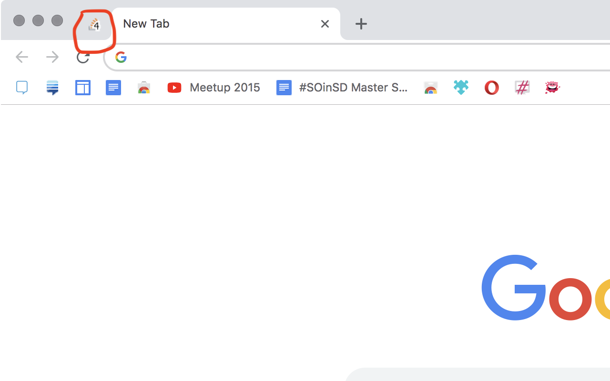

# Bonfire Unread Count

It does one and one thing only: It adds a count of unread messages on your current room to the favicon.

It could be a simple userscript if it weren't for the fact that favicons are served from a different domain... then, it involves [some CORS fun](https://github.com/g3rv4/BonfireUnread/blob/master/background.js).

You can load this unpacked (works for Chrome, Opera and Firefox) or you can download it from the following stores:
* [Chrome](https://chrome.google.com/webstore/detail/bonfire-unread-count/mjnidngiefjlkmkmjllnpbailmgecphn)
* [Firefox](https://addons.mozilla.org/en-US/firefox/addon/bonfire-unread-count/)